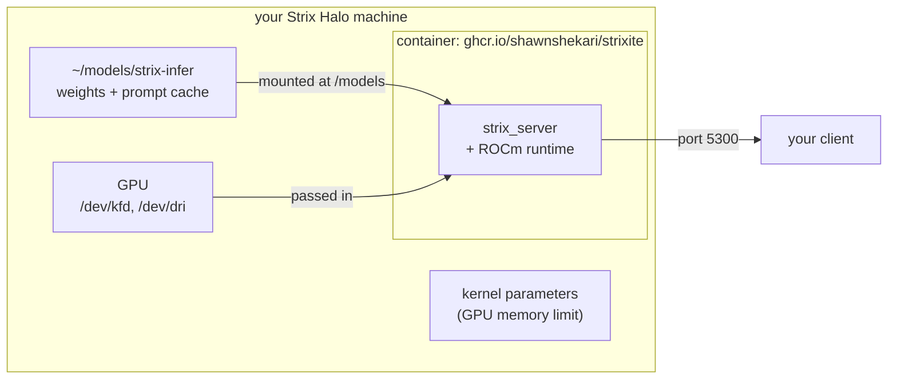

# Run strixite in a container

The container image has the server and its tools already built, with the ROCm runtime they need inside. You don't
install ROCm or a compiler, and it runs on any Linux distribution with podman or docker. You still download the
weights yourself (they're ~115 GiB and stay on your disk, outside the image), and the host still needs one kernel
setting the container can't make for you.



## 1. Prepare the host (once)

**Let the GPU use the memory.** Strix Halo's GPU allocates from system memory, and the default limit is far below
what the model needs. Add these kernel parameters (the same as for a source build - see the README's Quick start,
step 1) and reboot:

```
amdgpu.gttsize=126976 ttm.pages_limit=32505856 amd_iommu=off
```

Check: `cat /sys/class/drm/card*/device/mem_info_gtt_total` should report ~124 GiB (133,143,986,176 bytes).

**Install podman** (or docker) from your distribution: `sudo dnf install podman` on Fedora, `sudo apt install
podman` on Ubuntu / Debian.

**Give your user the GPU.** The GPU's device files belong to the `render` group (and on some distributions
`video`):

```sh
ls -l /dev/kfd /dev/dri/renderD*     # which group owns them
id -nG                               # your groups - render (and video) should be listed
sudo usermod -aG render,video $USER  # if not; then log out and back in
```

## 2. Download the weights (once)

```sh
pip install -U huggingface_hub   # provides the `hf` command, if you don't have it
hf download wemoh/Qwen3.8-Flash-Next-strixw --local-dir ~/models/strix-infer
(cd ~/models/strix-infer && sha256sum -c sha256.txt)
```

Every line should end in `OK`. Leave ~150 GB free on that disk beyond the weights: the server keeps a prompt cache
there (capped at 128 GiB, and it never leaves less than 32 GiB free).

## 3. Run it

```sh
podman run -d --name strixite \
  --device /dev/kfd --device /dev/dri \
  --group-add keep-groups \
  --security-opt seccomp=unconfined \
  --security-opt label=disable \
  -p 5300:5300 \
  -v ~/models/strix-infer:/models \
  --stop-timeout 90 \
  ghcr.io/shawnshekari/strixite:v0.2.3
```

What each line is for:

| flag | why |
|---|---|
| `--device /dev/kfd --device /dev/dri` | passes the GPU in: `kfd` is ROCm's compute interface, `dri` the render node |
| `--group-add keep-groups` | keeps your `render` / `video` membership inside the container, so it may open those devices (podman only - with docker use `--group-add render --group-add video`) |
| `--security-opt seccomp=unconfined` | lets the GPU driver's system calls through the default syscall filter |
| `--security-opt label=disable` | on SELinux systems (Fedora, RHEL), without it the container may not read files in your home directory, and the server stops with "can't open ... generation_config.json". Harmless where SELinux is off |
| `-p 5300:5300` | the API port; change the first number to publish it elsewhere |
| `-v ~/models/strix-infer:/models` | your weights, and the prompt cache (`/models/prompt-cache`, created on first use) - so the mount must be writable |
| `:v0.2.3` | the release; `:latest` is the newest release |
| `--stop-timeout 90` | on stop, the server first writes the conversations in its prompt cache's RAM to disk (up to ~40 s); `podman stop` / `docker stop` would otherwise kill it after 10 s - [Memory](memory.md#stopping-and-restarting) |

The server loads the weights in ~30 s. **Settings:** the image runs with the release's `deploy/strix-server.conf`;
any setting can be changed by adding its flag after the image name, e.g. `... strixite:v0.2.3 --capacity 262144`.
The full list: `podman run --rm ghcr.io/shawnshekari/strixite:v0.2.3 --help`.

## 4. Check it

```sh
curl -s localhost:5300/health          # {"status":"ok", ...} once loaded
podman logs -f strixite                # the startup lines, then one block per request
curl -s localhost:5300/v1/chat/completions -H 'Content-Type: application/json' \
  -d '{"messages":[{"role":"user","content":"Hello!"}]}'
```

Point any OpenAI-compatible client at `http://<your-machine>:5300/v1`, model `qwen3.8-flash-next`. The server has no
authentication: run it on a trusted network, or publish the port on localhost only (`-p 127.0.0.1:5300:5300`).

## 5. Start it at boot (optional)

With podman, a Quadlet file turns the container into a systemd service. Save this as
`~/.config/containers/systemd/strixite.container`:

```ini
[Unit]
Description=strixite (Qwen3.8-Flash-Next on Strix Halo)

[Container]
Image=ghcr.io/shawnshekari/strixite:v0.2.3
ContainerName=strixite
AddDevice=/dev/kfd
AddDevice=/dev/dri
PodmanArgs=--group-add keep-groups
SeccompProfile=unconfined
SecurityLabelDisable=true
PublishPort=5300:5300
Volume=%h/models/strix-infer:/models

[Service]
Restart=on-failure
RestartSec=15
# Exit 4: the startup memory check refused - restarting would load the weights again only to refuse again.
RestartPreventExitStatus=4
TimeoutStartSec=600
TimeoutStopSec=90

[Install]
WantedBy=default.target
```

Then:

```sh
systemctl --user daemon-reload
systemctl --user start strixite        # and status / stop / restart
loginctl enable-linger $USER           # start at boot, before you log in
```

`TimeoutStopSec=90`: on stop, the server writes its RAM-only prompt cache entries to disk first (up to ~40 s).
`RestartSec=15`: if the port is still held by a server that just stopped, systemd retries patiently instead of giving
up after five quick failures.

## Upgrading

```sh
podman pull ghcr.io/shawnshekari/strixite:v0.X.Y
podman rm -f strixite      # then run it again (step 3) with the new tag
```

With the Quadlet file, change the `Image=` line, then `systemctl --user daemon-reload && systemctl --user restart
strixite`. The weights only change when a release says so (the strixw format version is in every release's notes).
Prompt cache entries made by another version are checked at startup and dropped if they don't fit.

## Troubleshooting

| you see | it means |
|---|---|
| `Permission denied` opening `/dev/kfd`, or the server finds no GPU | your user isn't in the devices' group (step 1), or `--group-add keep-groups` is missing |
| `can't open '/models/...'` although the file exists | SELinux: add `--security-opt label=disable`; or the `-v` path doesn't point at the download directory |
| the server stops while loading, or `hipMalloc` / out-of-memory errors | the kernel parameters aren't active - check `mem_info_gtt_total` (step 1) |
| the server exits with status 4 right after loading | not enough free memory for these settings - the log says what to change; [Memory](memory.md) explains the options |
| `Address already in use` | something else listens on 5300 (another server, or an old container: `podman ps -a`) - or one just stopped: its closed connections hold the port for up to a minute (`ss -tan "( sport = :5300 )"` shows them); wait, or publish another port |
| a 400 naming a JSON schema keyword | structured output refuses what it can't enforce - [what the server accepts](server.md#structured-output) |

## What's inside

Fedora 43 (`fedora-minimal`), `strix_server`, `inspect_strixw` and the converters (`convert_qwen4exp`,
`convert_ngram_table`, `transcode_ngram_table`) in `/opt/strixite/bin`, and the ROCm runtime libraries they load
(from AMD's TheRock build for gfx1151) in `/opt/strixite/lib` - ~400 MB in all. Their licenses:
`/opt/strixite/NOTICE.md` and `/opt/strixite/licenses/`. The tools run the same way as the server, by naming them:

```sh
podman run --rm --device /dev/kfd --device /dev/dri --group-add keep-groups --security-opt label=disable \
  -v ~/models/strix-infer:/models --entrypoint inspect_strixw ghcr.io/shawnshekari/strixite:v0.2.3 \
  /models/converted/Qwen3.8-Flash-Next.U-gdn_in-g128/weights.strixw --verify
```

The image is built from the release tag with `deploy/container/build-image.sh`, so you can build it yourself from
source if you prefer.
