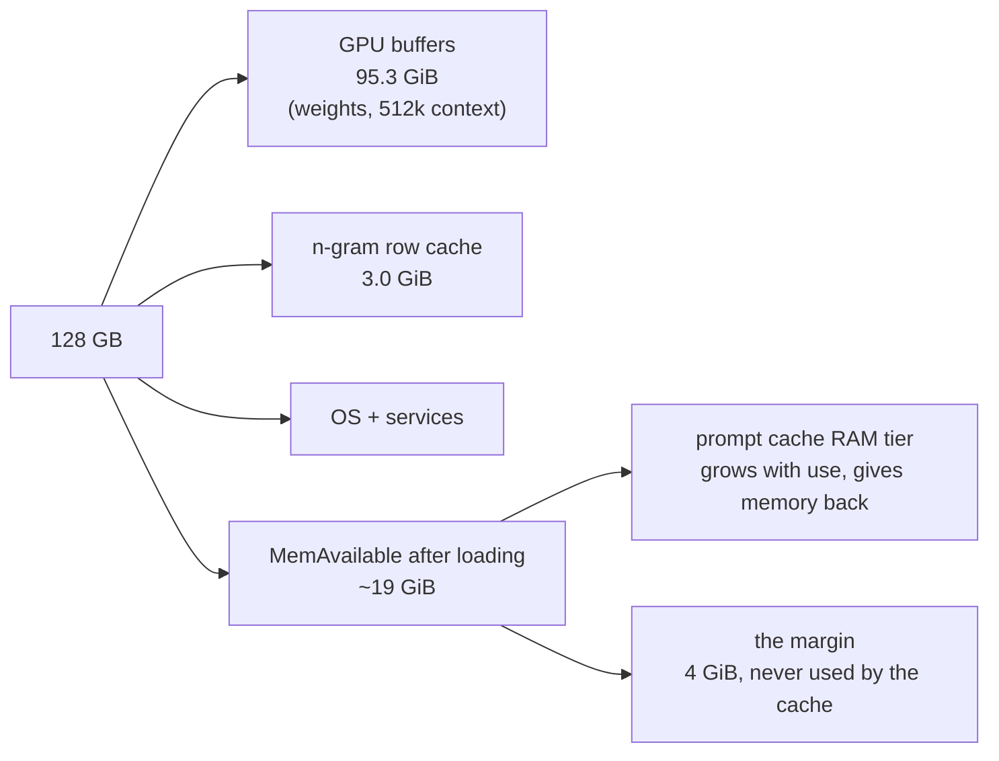
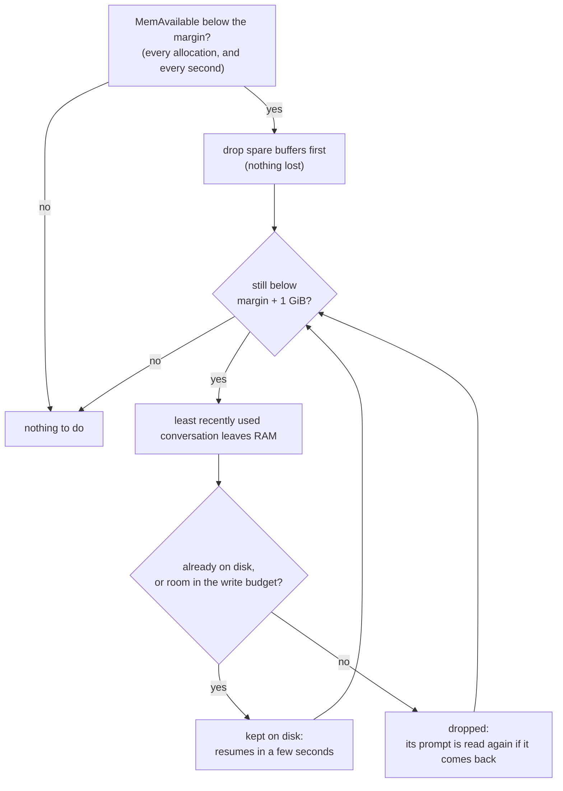

# Memory: where it goes, what the server checks, and how to share the machine

strixite is built for one job: a Strix Halo dedicated to serving a coding agent, with long contexts and a prompt
cache that makes switching between conversations cheap. The shipped settings assume exactly that machine - headless,
128 GB, nothing else running - because that's where it's fastest, and it's how I run it.

If your Strix Halo is also your desktop, or runs another model next to strixite, it works too: you change a couple of
settings and give up some context length or some caching. This page explains where the memory goes, what the server
does to stay out of trouble, and which settings to change for your machine.

**The short version:**

| your machine | what to do |
|---|---|
| dedicated to strixite, headless | nothing - the defaults are for you |
| also your desktop (browser, IDE, ...) | `capacity = 262144` and `prompt-cache-ram-margin-gib = 8` in `deploy/strix-server.conf` |
| also runs another model | lower `capacity` (and maybe `ngram-cache-rows`) until the startup check passes - [worked example below](#another-model-next-to-strixite) |
| you'd rather not think about it | `low-memory = adapt`: the server starts anyway and turns its caches down, telling you what each step costs |

## Why memory needs care on a Strix Halo

A graphics card has its own memory (VRAM). Strix Halo doesn't: the GPU and the CPU share the same 128 GB, and the
GPU's allocations come out of system memory (the kernel parameters in the Quick start's step 1 let it use nearly all
of it). That's what makes a ~180B-parameter model fit at all - and it means the model, the operating system, your
desktop and anything else you run all draw from one pool.

The number to watch is **MemAvailable** (in `/proc/meminfo`, or the "available" column of `free -g`): how much
memory the kernel could hand out right now, counting free memory plus caches it can drop. When it gets close to
zero, things fail in ugly ways. A GPU allocation that can't be satisfied doesn't come back as a tidy "out of memory":
it shows up as driver errors, the GPU runtime crashing, or - at about 0.5 GiB - the whole machine hanging until you
power-cycle it. I've had all three. Everything on this page is about never getting there.

## Where the 128 GB goes

With the shipped settings (`capacity = 524288`, `chunk = 16384`) on my machine:

| what | size | fixed or growing |
|---|---|---|
| **GPU buffers**: the weights (~66 GiB), the context's KV cache and state for 512k tokens, and the work buffers | 95.3 GiB | fixed at startup - nothing on the GPU grows afterwards |
| **n-gram row cache** (`ngram-cache-rows = 8388608`) | 3.0 GiB | fixed at startup |
| **prompt cache, RAM tier** | 0 at startup, grows with use | saved conversations, a few GB each |
| **the margin** (`prompt-cache-ram-margin-gib = 4`) | 4 GiB | kept free for the kernel and everything else |
| the operating system, services | a few GiB | |

That leaves **19.1 GiB of MemAvailable** right after the server loads, with nothing else running. The prompt cache
lives in what's left above the margin.



What each one is for:

- **The context** (`capacity`): the KV cache and state for the longest conversation the server will hold. It's
  allocated in full at startup, so a 512k context costs its memory even when your conversations are short. Halving
  it to 256k frees about 6.7 GiB.
- **The n-gram row cache**: the model has a 51B-parameter n-gram table that stays on the SSD; the rows it actually
  uses are cached in RAM so a prompt reads less from disk. 8M rows (3 GiB) is enough for several long agent
  sessions to share. Shrinking it to 262,144 rows frees 2.9 GiB and only costs some extra SSD reads while reading a
  prompt.
- **The prompt cache**: a coding agent sends the same long conversation again and again, a bit longer each turn,
  and often switches between conversations (the main session, a subagent, another project). Without a cache, every
  switch means reading the whole conversation again - at ~1,400 tokens/s, a 200k-token conversation is over two
  minutes. The prompt cache saves each conversation's state after a turn: a saved state is about 27 KiB per token
  plus 0.12 GB, so ~2.8 GB for a 100k-token conversation and ~5.5 GB for 200k. Coming back to one from RAM takes
  about a second; from disk, a few seconds. RAM is the fast tier; the disk (capped at 128 GiB) holds the rest and
  survives restarts.

## The margin: what the prompt cache never touches

The prompt cache keeps MemAvailable above `prompt-cache-ram-margin-gib`. When memory gets short, the least recently
used conversations leave RAM: written to disk if they aren't there already (within the write budget), and resumed
from there next time - a slower resume, never a wrong answer. The cache checks the margin:

- **before every allocation** - a save, or a load from disk - so it never takes memory that isn't there, and
- **every second in the background**, so memory another process takes *between* requests is answered too: a build
  or test suite your agent runs, a browser tab, another model warming up. Below the margin it frees down to the
  margin plus 1 GiB, so a process that keeps growing doesn't catch it again a second later.



**Why 4 GiB is the default:** on a dedicated machine nothing else grows, so the margin only has to cover the
kernel's own reserves and the moment between a process growing and the cache answering. Through long sessions at
512k I measured the lowest MemAvailable at 3.8-5.5 GiB, with conversations resuming from RAM in 1.2-1.4 s. In a test
where another process grabbed 0.5 GiB every second, MemAvailable dipped to 2.5 GiB for a moment before the cache
caught up and held it above the margin - that dip is exactly what the margin is there to absorb.

**Why you'd raise it:** a desktop grows in bursts - a browser opening a heavy page, an IDE indexing a project - that
can be bigger than 4 GiB at once. 8 GiB gives those bursts room without the cache having to scramble.

## The startup check

After the weights are loaded, the server measures MemAvailable and checks that it covers **the margin plus one
saved conversation at full capacity** - the biggest save it might ever have to make. With the shipped settings that's
4 + 13.5 = 17.5 GiB, and my dedicated machine has 19.1. The startup log says so in one line:

```
startup: memory: MemAvailable 19.1 GiB after loading (GPU buffers 95.3 GiB, n-gram row cache 3.0 GiB); needs the
prompt cache's RAM margin 4.0 GiB + one state at full capacity (524,288 tokens) 13.5 GiB = 17.5 GiB
```

That's only 1.6 GiB of slack, which is why "nothing else running" matters: restart the server while something else
holds a couple of GB and it won't start.

`low-memory` decides what happens when it doesn't fit:

- **`fail`** (the default): the server exits with status 4 and a message that says what it measured, what it needed
  and which settings would fit. From my machine with ~8 GiB taken by something else:

  ```
  fatal: not enough memory for these settings: MemAvailable 12.8 GiB after loading (...), short of the prompt
  cache's RAM margin 4.0 GiB + one state at full capacity (524,288 tokens) 13.5 GiB = 17.5 GiB by 4.7 GiB.
  To fit: free memory (another process?), or change: capacity = 262144 (state 6.8 GiB, at least 6.7 GiB less GPU
  memory), capacity = 131072 (state 3.5 GiB, at least 10.1 GiB less GPU memory), ngram-cache-rows = 262144 (frees
  2.9 GiB), prompt-cache-gib = 0 (no prompt cache). Or set low-memory = adapt ...
  ```

  The systemd unit (`deploy/strix-server.service`) and the container's [Quadlet file](container.md) don't restart on
  status 4, so a machine that's short of memory doesn't load the weights over and over only to refuse again.

  `fail` is the default because a server that starts short of memory fails later and worse - driver faults in the
  middle of a request, then a crash - and you'd be debugging the wrong thing.
- **`adapt`**: the server starts anyway and turns its caches down, cheapest first, only as far as needed, with one
  WARNING line per step that says what it costs and how to get it back:
  1. spare export buffers off - each save maps a fresh buffer (~0.2 s instead of ~0.05 at 100-200k tokens);
  2. if you raised the margin above 4 GiB: the RAM tier off - every save goes straight to disk and other
     conversations resume from there (at the default margin the tier stays on and simply holds less);
  3. the n-gram row cache shrunk, down to 262,144 rows - more SSD reads while reading a prompt;
  4. if it's still short: the longest conversation it can still save is logged - longer ones aren't saved, and are
     read again after a switch.

  While anything is turned down, every request's block in the log carries a "performance degraded" row and
  `/health` reports `degraded`, so it doesn't go unnoticed.

## Recipes

Change settings in `deploy/strix-server.conf` (or add the flag, e.g. `--capacity 262144`, to the command line or the
container's arguments). The numbers below are from my machine; your startup line has yours.

### A desktop on the same machine

```
capacity = 262144
prompt-cache-ram-margin-gib = 8
```

256k tokens is still a very long context - most agent sessions never get there. Halving it frees ~6.7 GiB of GPU
memory and shrinks the biggest possible save from 13.5 to 6.8 GiB, so the startup check needs 8 + 6.8 = 14.8 GiB
where ~26 GiB is available after loading: about 11 GiB left for the desktop, and the cache backs off from the 8 GiB
margin whenever the desktop needs more.

### Another model next to strixite

Take [issue #6](https://github.com/shawnshekari/strixite/issues/6)'s setup: a 27B model taking ~23 GiB on the same
machine. At the defaults that leaves almost nothing - which is how it crashed. What fits, from the numbers above:

| settings | MemAvailable after loading, minus 23 GiB | the check needs |
|---|---|---|
| defaults (512k) | 19.1 - 23 = below zero | 17.5 - no |
| `capacity = 262144` | ~25.8 - 23 = ~2.8 | 4 + 6.8 = 10.8 - no |
| `capacity = 131072` | ~29.2 - 23 = ~6.2 | 4 + 3.5 = 7.5 - no |
| `capacity = 131072`, `ngram-cache-rows = 262144` | ~32.1 - 23 = ~9.1 | 7.5 - **yes**, ~1.6 GiB to spare |

So: a 128k context and the small row cache, and keep the margin at 4 GiB - raising it would undo the fit. Start the
other model first, so strixite's startup check measures the memory that's really left. If the other model grows
while it runs, the background check moves strixite's saved conversations to disk to make room.

### Not sure? Let it adapt

```
low-memory = adapt
```

The server starts with whatever fits and the WARNING lines tell you what it turned down. Once you see what it chose,
setting `capacity` yourself usually gets a better trade - a shorter context costs nothing until a conversation
reaches it, while a smaller cache costs a little on every switch.

## Checking your own machine

- **Before starting:** `free -g` - the "available" column is what's left for strixite. The defaults want ~117 GiB
  available before loading.
- **At startup:** the `startup: memory:` line above - what was measured, what's needed. `journalctl --user -u
  strix-server.service` for the systemd unit, `podman logs` for the container.
- **While it runs:**
  - `curl 127.0.0.1:5300/health` - `"status": "ok"`, and a `degraded` field if adapt turned something down;
  - `curl 127.0.0.1:5300/cache` - the prompt cache: entries in RAM and on disk, bytes, hits;
  - `curl 127.0.0.1:5300/metrics` - counters, e.g. `strix_prompt_cache_ram_evicted_total` (conversations that left
    RAM for lack of memory) and `strix_prompt_cache_rejected_total` (ones that couldn't be written and were dropped);
  - the log every ten minutes while the cache is in use: `prompt cache: RAM N entries, X GB ...; MemAvailable Y GiB
    (margin 4)`.

## Disk: the prompt cache's second tier, and its write budget

The prompt cache also uses the drive the models are on. Three settings bound it:

| setting | default | what it does |
|---|---|---|
| `prompt-cache-gib` | 128 | the most saved conversations on disk, in GiB; the least recently used go first. 0 turns the prompt cache off |
| `prompt-cache-disk-free-gib` | 32 | a write never leaves less than this free on that filesystem |
| `prompt-cache-write-gib-per-hour` | 32 | the write budget: how much the cache may write per hour (0 = no limit) |

**When the cache writes.** A conversation is saved to RAM after each turn; it reaches the disk only (1) when it has
to leave RAM for lack of memory, (2) after sitting in RAM unused for `prompt-cache-idle-s` (3600 s - it stays in RAM
too, so a restart can pick it up), or (3) when the server stops cleanly, newest first. Most saves are deltas: a turn
that extends a saved conversation by up to 64k tokens (and at most a quarter of its length) stores only the new
tokens' state - ~27 KiB each plus ~0.12 GB - not the whole conversation again. Losing what wasn't written yet (a
power cut) only means reading that prompt again.

**The write budget** exists for SSD wear. Saved states are big (a 200k-token conversation is ~5.5 GB), and an agent
working through many conversations at once could otherwise keep the drive writing all day for little benefit. The
budget is a bucket: it starts full (one hour's worth), refills continuously at the hourly rate, and rules (1) and
(2) spend from it; the shutdown write is free. When it's empty, an idle write simply waits - but a conversation that
*has* to leave RAM and can't be written is dropped, and the log says so - for example:

```
prompt cache: dropped a turn entry of 95,112 tokens, 2.7 GB (saved by Request 812, last used 4 min ago)
              it had to leave RAM (MemAvailable 3.9 GiB, below the 4 GiB margin) and can't go to disk:
              the write budget is spent (0.4 of 32 GiB left this hour, needs 2.7 GB: enough in 4 min)
```

A dropped conversation isn't lost work, just time: when the agent comes back to it, its prompt is read again
(~1,400 tokens/s).

**Why 32 GiB an hour.** I measured both sides. With 64 and no delta saves, a long session wrote 240 GB in ~3 hours
for 3 conversations ever read back - wear for nothing. With 8, two deep agent sessions at once (~200k and ~95k
tokens) dropped 38 conversations in 2.3 hours, and the smaller one came back to a full re-read three times, ~55 s
each. 32 sits between: enough for two or three busy agents switching back and forth, and at most ~770 GiB a day
even if it's spent every hour - in practice far less, since the bucket only drains under memory pressure and idle
writes are mostly small deltas. Compare that with your drive's rated endurance (TBW) if you want the worst case in
years.

**When to change it:**

- **Raise it** (64, or more) if the log shows "the write budget is spent" drops while you work - typically several
  agents with long conversations, on a machine where RAM is tight (a desktop, another model). You
  trade drive writes for not re-reading prompts.
- **Lower it** (8-16) if drive wear matters more to you than an occasional re-read - one agent at a time, or a
  machine with plenty of RAM where conversations rarely have to leave it.
- **`prompt-cache-idle-s`**: lower (e.g. 600) writes idle conversations sooner - more writes, less lost to a power
  cut or a crash; higher writes less.
- **`prompt-cache-gib`**: lower if the drive is small - the cache evicts its oldest entries to stay under it;
  `prompt-cache-disk-free-gib` keeps it from ever filling the drive regardless.

**Watching it:** the log's ten-minute status lines include `write budget X of 32 GiB left this hour`;
`/metrics` has `strix_prompt_cache_bytes_written_total`, `strix_prompt_cache_writes_by_rule_total` (evict / idle /
shutdown) and `strix_prompt_cache_rejected_total{reason="budget"}` - the conversations the budget dropped. The
entries are the server's own: safe to delete while it's stopped.

## Stopping and restarting

**On a clean stop** - `systemctl --user stop`, Ctrl-C, `podman stop` - the server writes every conversation that's
in RAM but not on disk yet, newest first, then exits. This write doesn't count against the write budget; it gets up
to 40 seconds, which at NVMe speeds is tens of GB (a 1.6 GB conversation takes under a second). Whatever doesn't make
it in time is lost - never half-written: an unfinished file is deleted at the next start - and is read again when
the agent comes back to it.

**Give it the time.** A stop that kills the server before it's done cuts the write short:

- the systemd unit (`deploy/strix-server.service`) and the container's [Quadlet file](container.md) wait 90 s;
- `podman stop` and `docker stop` wait only 10 s before killing it - start the container with `--stop-timeout 90`
  (the [container guide's](container.md) `podman run` line has it), or stop it with `podman stop -t 90 strixite`.

**What isn't written:** a one-shot request - a single message with no tools, the kind a script sends - is kept in
RAM only and never written; it isn't part of a conversation that will come back. A crash or a power cut writes
nothing. (A lost GPU context - the server exiting with status 3 so a supervisor restarts it - still writes what it
has in RAM first; the cache lives in host memory.)

**After a restart** the RAM tier is empty, and each saved conversation comes back from disk the first time the
agent sends it - a few seconds instead of re-reading it - and lives in RAM again from then on. Saved conversations
only fit the model and settings they were made with: entries from other weights, another activation type, MTP
switched on or off, or another `rope-yarn-factor` are deleted at startup. Changing `capacity`, the margin or the
budgets keeps them.

## Symptoms

| you see | it means | try |
|---|---|---|
| the server exits with status 4 right after loading | the startup check failed | the fixes in the message, or stop whatever else is using memory |
| "performance degraded" in every request's log block, `degraded` in `/health` | `low-memory = adapt` turned something down | the startup WARNING lines name each step and how to get it back |
| "below the 4 GiB margin between saves (another process grew)" in the log | something else grew and conversations moved to disk | fine now and then; often means the margin or `capacity` is too tight for this machine |
| "dropped a ... entry" warnings | a conversation had to leave RAM and couldn't be written (write budget or disk space) | it's read again when it comes back; if the reason is the budget and it happens a lot, raise `prompt-cache-write-gib-per-hour` ([Disk](#disk-the-prompt-caches-second-tier-and-its-write-budget)) |
| switching conversations is slow | they're coming back from disk, not RAM | more free memory, or a lower `capacity` to leave the cache more room |
| driver errors, `hipErrorOutOfMemory`, a crash, a hang | the machine ran out of memory | check the kernel parameters (Quick start step 1), then this page - the defaults assume nothing else is running |
